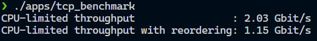

# CS144 实验笔记（2021FALL）

## 写在前面

用的wsl2做实验，结果最后几个lab更改webget的时候没法连接外网会超时，此外全部跑通。用了大概两周的时间，没看课程视频，基本就是对着讲义面向测试用例编程。该说不说，这个测试用例是真的翔实，我做完都被震撼到了...

命令`ctest --output-on-failure -R [测试用例名称]`可以只运行特定的测试用例，并输出报错信息。

## Lab0 networking warmup

webget比较简单就直接跳过了。  
本节实现一个字节流类`ByteStream`，可以从流的开头读出数据，从流的末尾写入数据，类似于队列。  
`ByteStream`内读写的数据可以直接用`std::string`来存储。成员函数中比较关键的是`read`和`write`。  
`read`函数可以用substr很轻松的实现。`write`函数内需要判断一下写入`data`后是否会超过`capacity`。
``` cpp
size_t ByteStream::write(const string &data) {
    if(_eof)return 0;
    size_t num = remaining_capacity();
    if(num < data.size())
    {
        stream += data.substr(0, num);
        written += num;
        return num;
    }
    stream += data;
    written += data.size();
    return data.size();
}
```

## Lab1 stitching Substrings Into a Byte Stream

本节实现一个流重组器类`StreamReassembler`，可以将收到的不连续的、可能会重复的数据重组成一个连续的字节流，主要用于解决TCP接收乱序包的问题。  
本节的关键是正确理解讲义中*capacity*那张图片，也即`first_unread`, `first_unassembled`, `first_unacceptable`这三个变量的含义。  
首先，`first_unread`就是类中的ByteStream的`bytes_read`返回值；有了前者，就可以很轻松的得到`first_unacceptable`的值，也就是`first_unread + capacity`；而`first_unassembled`代表的是已经向字节流写入了多少已重组好的数据，需要在写入时更新。  
由于收到的数据不连续，需要一个合适的数据结构来存储提前到来的数据。这里我使用的是`std::map<size_t, std::pair<std::string, bool>>`，这也和函数`push_substring`的参数一致。  
直接看函数`push_substring`的代码：
```cpp
void StreamReassembler::push_substring(const string &data, const size_t index, const bool eof) {
    first_unread = _output.bytes_read();
    first_unacceptable = first_unread + _capacity;
    if(index + data.size() <= first_unacceptable)
        insert_to_unassembled(std::move(data), index, eof);
    else
        insert_to_unassembled(std::move(data.substr(0, first_unacceptable - index)), index, false);
    ...
}
```
在函数第一部分，先对`first_unread`和`first_unacceptable`进行更新，之后判断接受到的数据是否超出了*capacity*，是的话需要对数据进行裁剪，最后将数据插入到`map`中。需要注意的是，插入时应该先判断`map`中是否已经含有当前`index`。如果有的话，应该将尽可能长的`data`更新到`map`中，同时注意更新`eof`。  
下面是第二部分(`unassembled`是`map`的变量名)：
```cpp
void StreamReassembler::push_substring(const string &data, const size_t index, const bool eof) {
    ...
    while(!unassembled.empty())
    {
        auto &[idx, pair] = *unassembled.begin();
        if(idx <= first_unassembled)
        {
            if(idx + pair.first.size() > first_unassembled)
            {
                _output.write(pair.first.substr(first_unassembled - idx));
                first_unassembled = idx + pair.first.size();
            }
            if(pair.second) _output.end_input();
            unassembled.erase(unassembled.begin());
        }
        else break;
    }
    ...
}
```
在第二部分中，对存着未重组数据的`map`进行取数据。每次取`map.begin()`的数据，这用到了`map`会根据key进行排序的特点，而根据`map`的定义式可知，每次取得begin的数据都是`index`最小的数据。对于每次取得的数据，如果其`index`>`first_unassembled`，说明`map`中`index`最小的数据段都无法写入，直接break跳出循环；否则，说明可以将这段数据写入流。但要额外判断一下是否这一整段数据是否已经被`index`更小的段完整的写过了，也即第二个if的作用。在写入后将`map`中的这个pair删除掉，从而可以迭代向流中写入重组好的数据。
```cpp
void StreamReassembler::push_substring(const string &data, const size_t index, const bool eof) {
    ...
    vector<std::pair<size_t, std::pair<std::string, bool>>> vec;
    num_of_unassembled_bytes = 0;
    for(auto it = unassembled.begin(); it != unassembled.end(); ++it)
    {
        if(vec.empty() || it->first > vec.back().first + vec.back().second.first.size())
        {
            vec.push_back(*it);
            num_of_unassembled_bytes += it->second.first.size();
            continue;
        }
        auto &back = vec.back();
        auto &idx = back.first; auto &str = back.second.first;
        assert(idx < it->first && it->first < idx + str.size());
        if(it->first + it->second.first.size() < idx + str.size())continue;
        num_of_unassembled_bytes += it->second.first.size() - idx - str.size() + it->first;
        str += it->second.first.substr(idx + str.size() - it->first);
    }
    unassembled = std::move(std::map<size_t, std::pair<std::string, bool>>(vec.begin(), vec.end()));
}
```
函数第三部分中，对`map`进行整理。下面用[index, index + data.size()]的方式来表示传入的一个数据段。考虑`map`中可能存在[1, 3], [2, 4]的数据，而这显然可以用[1, 4]来代替，从而减少空间的消耗。  
如何实现上述效果呢？我的方法是用一个`std::vector`来作为栈，然后遍历存储未重组数据段的`map`。当栈空，或者**栈顶的数据段a尾部（即index + data.size()）< 遍历到的数据段b的index**（说明两个数据段没有交集）时，就将遍历到的数据段压入栈中。否则，就将a和b合并成一个数据段压入栈中。需要注意的是，有可能a完全包含b，那么此时就不需要合并，继续遍历即可。  
遍历过程中可以维护变量`num_of_unassembled_bytes`，作为函数`unassembled_bytes`的返回。遍历完成后，直接根据`vector`来重构`map`。

### Lab1总结
Lab1的难度不算小，需要考虑的边界问题也比较多，但总体思想还是比较清晰的，只是最开始理解要做什么属实有点困难...我认为可以理解成向空的字符串里填充字符，不是按顺序填，不能填重复了，也不能填漏了。

## Lab2 the TCP receiver

本节实现TCP的接收端。难点在于相对seqno和绝对seqno的互相转换。

首先实现`32-bit`数与`64-bit`数的互相转换。这是因为TCP的报文段只能支持`32-bit`的seqno和ackno，但`32-bit`只有4GB，并不是很够用，所以需要这个转换。  
`64-bit`向`32-bit`的wrap比较简单：
```cpp
WrappingInt32 wrap(uint64_t n, WrappingInt32 isn) {
    return WrappingInt32{static_cast<uint32_t>(n + isn.raw_value())};
}
```
难点在于`32-bit`向`64-bit`的unwrap。这需要一个checkpoint来指示转换的具体位置，否则同一个`32-bit`数可以转换出2^32个`64-bit`数。有了checkpoint，我们就可以确定离它最近的那个数是我们想要的。  
共分为两种情况:  
<div align=center>
    
</div>

情况1：`(offset = n - wrap(checkpoint, isn)) > 0`，此时只需要根据距离决定是`ret`还是`ret - (1ul << 32)`。  
<div align=center>
    
</div>

情况2：`(offset = n - wrap(checkpoint, isn)) < 0`，此时只需要根据距离决定是`ret`还是`ret + (1ul << 32)`。 
unwrap代码：
```cpp
uint64_t unwrap(WrappingInt32 n, WrappingInt32 isn, uint64_t checkpoint) {
    int32_t offset = n - wrap(checkpoint, isn);
    uint64_t ret = checkpoint + offset;  // 判溢出
    if (offset > 0) {
        return offset < (1l << 31) ? ret : ret - (1ul << 32);
    }
    return (ret <= checkpoint && offset > -(1l << 31)) ? ret : ret + (1ul << 32);
}
```
最后一行`ret <= checkpoint`是因为当`checkpoin + offset`可能会反向溢出成特别大的一个数，因此需要特判。  

关于TCPReceiver，有几点要说明。  
1.关于`segment_received`函数，根据报文的seqno来unwrap计算数据段的index时，要注意特别考虑报文的syn标记，不是syn包的要注意减去1。但又由于index数据类型为uint64_t，可能在减去1后反向溢出，因此需要特判。unwrap的checkpoint参数可选择stream_out().bytes_written()。  
2.关于`ackno`函数，只有收到过syn包后才有效。可以直接根据stream_out().bytes_written()计算，但要记得+1(syn信号)，如果流已经结束还要再+1(fin信号)。

## Lab3 the TCP sender

本节实现TCP的发送端。难度直线上升...建议仔细阅读实验讲义，然后面向测试用例编程。

1.本节需要在类内定义比较多的变量，以下是我定义的一些变量。
```cpp
// outstanding segs
std::queue<TCPSegment> _outstanding{};

unsigned int _consecutive_retransmissions{0}, _RTO;

// 是否发送过fin报文
bool _fin_sent{false};

// 已收到的最大的ackno
uint64_t _mx_ackno{0};

uint64_t _bytes_in_flight{0};
uint16_t _window_size{1};

// 计时器
retx_timer _timer{};
```
2.关于`fill_window`函数。有可能`window_size`非常大，因此在函数内会发送多个报文。可以通过滑动窗口的方式来进行循环处理，设置窗口左端为`_next_seqno`，窗口右端为`_mx_ackno + max(static_cast<uint16_t>(1), _window_size)`，因为有可能`window_size`为0，因此需要一个`max`调整。还有一点，发送fin报文需要特殊处理，因为fin也会占一位，所以需要先判断窗口的大小能不能容下fin这一位，能容下时才能把fin标记置为true。  
3.关于`ack_received`函数。对ackno的unwrap可以用`_stream.bytes_read()`作为checkpoint。当`ackno > _next_seqno`时说明收到的报文出错了，可以直接return。之后不断取`_outstanding.front()`，如果没能完整确认该报文(即`segno + seg_sz - 1 < _ackno`)就可以break出循环，因为`_outstanding`是按顺序压入的数据段。否则更新`_mx_ackno`，将该数据段弹出，继续确认。  
4.关于`tick`函数，该函数用于更新计时器的时间。对所有outstanding数据段，如果计时器超时，需要重传数据段，并更新超时上限。

## Lab4 the TCP connection

本节实现TCP连接。难度最大的一节，我大概调了两天。前面写的倒是没有出太多bug。建议也是细读讲义。

1.在sender将要发送的报文放到segments_out里之后，在TCPConnection层需要取出报文再发送。用函数`send`实现，将报文头填充好。
```cpp
void TCPConnection::send()
{
    while(!_sender.segments_out().empty())
    {
        TCPSegment &seg = _sender.segments_out().front();
        if(_rst)
        {
            seg.header().rst = true;
        }
        if(_receiver.ackno().has_value())
        {
            seg.header().ack = true;
            seg.header().ackno = _receiver.ackno().value();
            seg.header().win = _receiver.window_size();
        }
        _segments_out.push(seg);
        _sender.segments_out().pop();
        if(_rst)break;
    }
    while(!_sender.segments_out().empty())
        _sender.segments_out().pop();
}
```
2.关于`segment_received`函数。如果rst位有效，连接出错，结束连接。先调用`_receiver.segment_received(seg)`。如果ack位有效，调用`_sender.ack_received(seg.header().ackno, seg.header().win)`。如果syn位有效，sender也应该发送syn信号(调用`_sender.fill_window()`)，这对应于TCP的三次握手。  
3.clean shutdown：当receiver收到fin包，且sender未发送fin包时，`_linger_after_streams_finish`变量置为false。sender先对收到的fin包向另一端发送ack包，然后发送fin包。等待接收另一端的ack包，收到后连接关闭。对于另一端的TCP，在发送fin包的ack包后，等待`10 * _cfg.rt_timeout`(2*MSL)的时间后关闭连接，这对应于TCP的四次挥手。  
4.如果超时重传次数过多，判定为连接出错，发送rst包。  

### Lab4总结

对于理解TCP的三次握手和四次挥手很有帮助。需要理解好网络的状态转移图，这样对样例报错也能更好的理解原因并应对。在make check的时候要把debug的输出全都删除掉，不然会影响报文的校验码检测，出现ERROR。

## Lab5 the network interface

本节实现链路层arp协议。arp协议，将ip地址转换为MAC地址。当本地缓冲中存在ip地址对应的MAC地址，则直接发送数据帧；否则广播需要的ip地址以获得MAC地址。

1.关于`send_datagram`函数。用一个map储存ip地址到MAC地址的映射。难点在于数据帧的构造，对于arp数据帧，需要先构造arp报文，再用arp报文作为payload构造数据帧。先查询next_hop的本地缓存，存在则直接发送数据帧，否则需要发送ARP请求报文。  
2.关于`recv_frame`函数。接收数据帧。如果目标MAC地址不是广播地址且不是本机地址，直接忽略。如果是ipv4协议，直接解析数据帧并返回给上层应用。如果是arp协议，是arp请求且请求的ip地址是本机地址，则发送arp回复报文。

## Lab6 the IP router

本节实现路由转发。

1.实现一个结构体用于储存路由表中的每个表项。路由表用set来存储，因此需要自定义结构体的比较方法，这里按照路由的最长匹配规则进行排序，可以保证最先遍历到的时最优匹配项。
```cpp
class route_entry{
    public:
    uint32_t route_prefix;
    uint8_t prefix_length;
    std::optional<Address> next_hop;
    size_t interface_num;

    route_entry(const uint32_t _route_prefix,
                const uint8_t _prefix_length,
                const std::optional<Address> _next_hop,
                const size_t _interface_num)
        : route_prefix(_route_prefix)
        , prefix_length(_prefix_length)
        , next_hop(_next_hop)
        , interface_num(_interface_num) {}

    bool operator<(const route_entry &a) const {
        if (prefix_length != a.prefix_length)
            return prefix_length > a.prefix_length;
        if (route_prefix != a.route_prefix)
            return route_prefix < a.route_prefix;
        return interface_num < a.interface_num;
    }
};
```
2.路由时，遍历本地路由表，检测是否有表项满足匹配。匹配方法是根据高位匹配长度n，n不为0时，将ip和路由表ip右移(32-n)位，然后比对是否一致；当n为0时，说明一定匹配。代码如下：
```cpp
void Router::route_one_datagram(InternetDatagram &dgram) {
    // Your code here.
    if(dgram.header().ttl == 0 || dgram.header().ttl == 1)return;
    --dgram.header().ttl;
    for(auto it=route_table.begin();it!=route_table.end();++it)
    {
        auto &entry = *it;
        uint32_t a = entry.route_prefix;
        uint8_t n = entry.prefix_length;
        uint32_t b = dgram.header().dst;
        if(n!=0)a >>= (32 - n), b >>= (32 - n);
        if(n==0 || a == b)
        {
            Address next_hop = entry.next_hop.has_value() ? entry.next_hop.value() : Address::from_ipv4_numeric(dgram.header().dst);
            interface(entry.interface_num).send_datagram(dgram, next_hop);
            break;
        }
    }
}
```

Lab7没有实质工作就没做了。

## cs144总结

充分学习了面向测试用例的编程doge。实验真的很棒，可以和别人吹水说自己实现了一个TCP协议栈。感觉做完的关键是要能看懂测试出错原因...很多时候我并没有明白要实现什么功能，是靠测试用例报错来猜着去实现的...

最后放一下实验结果。

<div align=center>
    <br>
    <div style="color:orange; border-bottom: 1px solid #d9d9d9;
    display: inline-block;
    color: #999;
    padding: 2px;">
      测试样例全部通过
  	</div>
</div>

<div align=center>
    <br>
    <div style="color:orange; border-bottom: 1px solid #d9d9d9;
    display: inline-block;
    color: #999;
    padding: 2px;">
      性能测试也合格
  	</div>
</div>

感觉我这个笔记写的挺烂的hhh。
